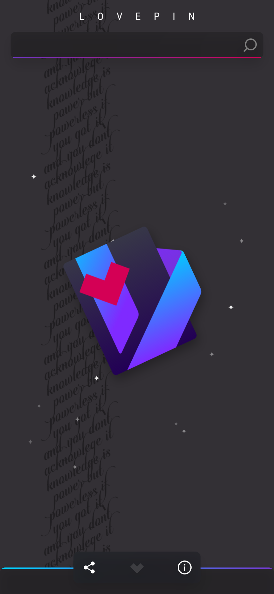
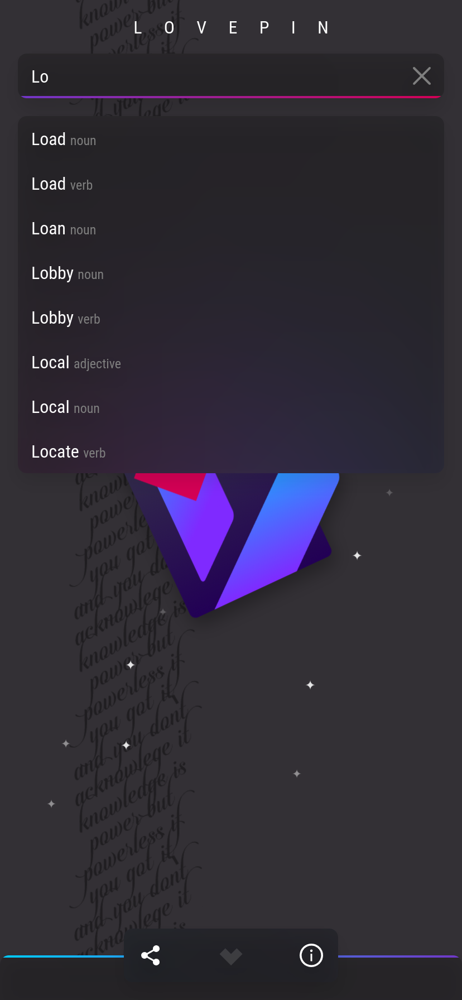
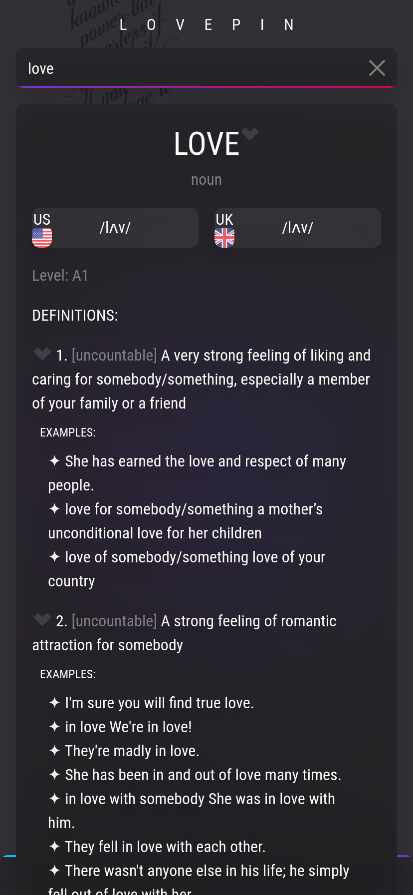

# Lovepin

Lovepin is a free open-source dictionary-alike progressive web app. It's not a dictionary. Instead it only contains the Oxford5000 words, from level A1 all the way up to level C2.

You can use this app to easily learn these words. People who want to take IELTS exam would find this app really handy.

## Installation

Lovepin runs on all platforms; Windows, Linux, Mac, Android, IOS and etc. You don't need to install any native modules to run Lovepin since it's a PWA app as it runs on web just fine. If you like, you can just install the PWA, using your browser. (We highly recommend using chromium based browsers like Google Chrome, Edge or Brave)

## Screenshots

## Usage

Search the word you want. You can like the word (like the way you like words on Instagram) and then you will have it listen in the "love list" panel so later you can review your word.

You can also like specific word definitions so to note which definition you once looked for.

Pretty much clear and easy to use right? :D
## Contribution

Even if you are not a programmer any type of contribution is welcome. From fixing typos to improving Lovepin App in whole. If you don't know how to contribute, you can open issues and (for example) give recommendations or report bugs.

For developers, since Lovepin is written in React.js, you would need these as prerequisites:

- Node >= v16.14.2
- Yarn >= v1.12.18
- npm >= 8.7.0

**Note:** _Pull requests are welcome. For major changes, please open an issue first to discuss what you would like to change._

### Steps:

1. Clone the Lovepin repo:
   `git clone git@github.com:alixsep/lovepin.git`

2. Make sure you are in the correct directory:
   `cd lovepin`

3. Install the required node modules:
   `yarn install && yarn initial-setup`

4. In order to be able to see the app running without actually deploying it, use the view script:
   `yarn view`.
   Note that without doing so, you won't be able to fetch the database json file because axios doesn't fetch local json files. After you fetched the database, you can use
   `yarn start`
   next times to be able to see your coding changes immediately. Also service workers won't work in development phase using yarn. If you know a way to get rid of this work around, feel free to contribute.
   Changing database means you have to delete cache in devtools > Application tab. and run `yarn view` again.

## Credits

**Founder: [Alixsep](https://github.com/alixsep)**

\>\>\> _By contributing, your name will be listed here._

## Show your support

Star ⭐ this repository if you enjoy Lovepin!

## License

[GPLv3](https://choosealicense.com/licenses/gpl-3.0/)
